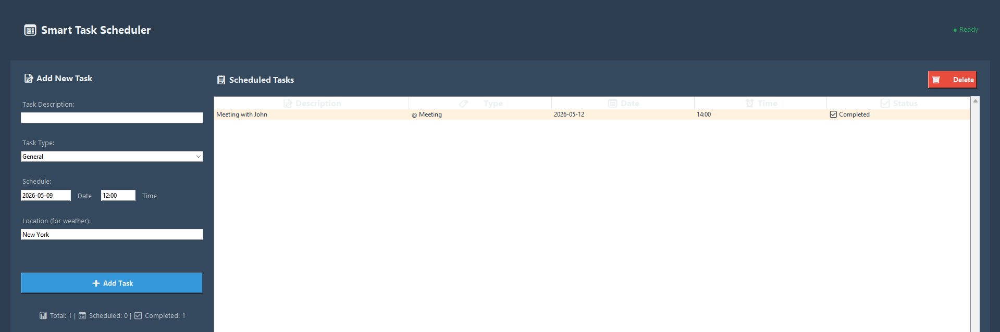
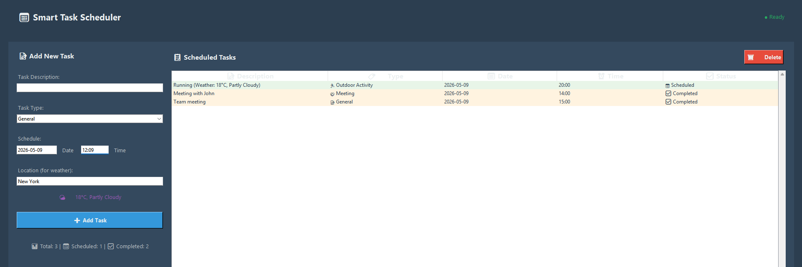
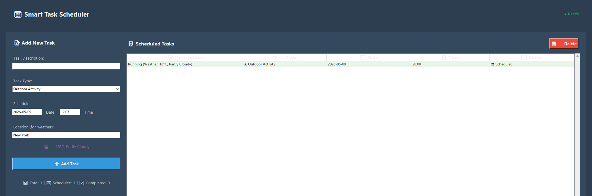

# Smart Task Scheduler with API Integration

A Python desktop application that demonstrates API integration, GUI development, and intelligent task scheduling with weather notifications. This project showcases the ability to connect different services and build user-friendly tools - essential skills for freelance Python developers.





## 🌟 Features

- **Intuitive GUI Interface**: Clean, user-friendly desktop application built with Tkinter
- **Smart Weather Integration**: Automatically fetches weather forecasts for outdoor activities using OpenWeatherMap API
- **Desktop Notifications**: Native system notifications when tasks are due
- **Persistent Storage**: Tasks are saved to JSON file and persist between sessions
- **Task Management**: Add, delete, and track tasks with different categories
- **Automated Scheduling**: Background scheduler ensures notifications are sent on time

## 🛠️ Technologies Used

- **GUI Framework**: Tkinter (Python's built-in GUI library)
- **API Integration**: Requests library for OpenWeatherMap API
- **Task Scheduling**: Schedule library for time-based notifications
- **Desktop Notifications**: Plyer library for cross-platform notifications
- **Data Storage**: JSON file for task persistence
- **Date/Time Handling**: Python datetime and dateutil libraries

## 📋 Requirements

- Python 3.7 or higher
- OpenWeatherMap API key (free registration required)

## 🚀 Installation

1. **Clone or download the project files**
2. **Install dependencies**:
   ```bash
   pip install -r requirements.txt
   ```

3. **Get your free OpenWeatherMap API key**:
   - Visit [OpenWeatherMap](https://openweathermap.org/api)
   - Sign up for a free account
   - Generate an API key
   - Replace `"YOUR_API_KEY_HERE"` in `main.py` with your actual API key

4. **Run the application**:
   ```bash
   python main.py
   ```

## 📖 Usage Guide

### Adding Tasks

1. **Enter Task Description**: Type what you need to do
2. **Select Task Type**: Choose from:
   - General (regular tasks)
   - Meeting (professional appointments)
   - Outdoor Activity (gets weather info automatically)
3. **Set Date and Time**: Use YYYY-MM-DD format for date and HH:MM for time
4. **Location (Optional)**: Enter a city name for weather forecasts
5. **Click "Add Task"**: Your task will be scheduled and saved

### Task Features

- **Weather Integration**: Outdoor activities automatically fetch current weather data
- **Desktop Notifications**: You'll receive a system notification when tasks are due
- **Task Status**: Track whether tasks are Scheduled or Completed
- **Persistent Storage**: All tasks are saved and reload when you restart the app

### Managing Tasks

- **View Tasks**: All scheduled tasks appear in the main list
- **Delete Tasks**: Select a task and click "Delete Selected Task"
- **Automatic Updates**: Task status updates automatically when notifications are sent

## 🏗️ Project Structure

```
smart-task-scheduler/
├── main.py              # Main application file
├── requirements.txt     # Python dependencies
├── tasks.json          # Task storage (auto-generated)
└── README.md           # This file
```

## 🎯 Key Code Components

### GUI Design
- **Main Window**: 800x600 pixel interface with organized layout
- **Input Controls**: Entry fields, dropdown menus, date/time selectors
- **Task Display**: Treeview widget showing all scheduled tasks
- **Responsive Layout**: Grid-based layout that scales properly

### API Integration
```python
def get_weather_info(self, location):
    """Fetch weather data from OpenWeatherMap API"""
    params = {
        'q': location,
        'appid': self.weather_api_key,
        'units': 'metric'
    }
    response = requests.get(self.weather_base_url, params=params)
    # Process and return weather data
```

### Scheduling System
```python
def schedule_task(self, task):
    """Schedule notifications using the schedule library"""
    schedule.every().day.at(task_datetime.strftime("%H:%M")).do(
        self.show_notification, 
        task['description'],
        task['id']
    )
```

## 🌤️ Weather Integration Details

For "Outdoor Activity" tasks, the application:
1. Automatically calls the OpenWeatherMap API
2. Fetches current temperature and weather conditions
3. Appends weather info to the task description
4. Example: "Go for a run (Weather: 15°C, Clear Sky)"

## 📱 Sample Screenshots

*(Note: Add actual screenshots when showcasing in portfolio)*

1. **Main Interface**: Clean GUI with input fields and task list
2. **Adding Task**: Dialog showing task creation with weather integration
3. **Desktop Notification**: System notification appearing when task is due
4. **Task List**: Multiple tasks showing different types and statuses

## 🔧 Customization Options

### Adding New Task Types
Modify the `task_type_combo` values in `main.py`:
```python
values=["General", "Meeting", "Outdoor Activity", "Custom Type"]
```

### Changing Weather API
Replace the OpenWeatherMap integration with any other weather service by modifying the `get_weather_info()` method.

### Notification Customization
Adjust notification settings in the `show_notification()` method:
```python
notification.notify(
    title="Custom Title",
    message=description,
    timeout=15  # Longer display time
)
```

## 🐛 Troubleshooting

### Common Issues

1. **API Key Error**: Make sure you've replaced `"YOUR_API_KEY_HERE"` with your actual OpenWeatherMap API key
2. **Weather Not Loading**: Check your internet connection and API key validity
3. **Notifications Not Working**: On some systems, you may need to enable notification permissions
4. **Past Date Error**: The app prevents scheduling tasks in the past

### Debug Mode
Add print statements to track issues:
```python
print(f"Scheduling task: {task['description']} for {task['datetime']}")
```

## 🚀 Portfolio Showcase Tips

### What This Demonstrates
- **API Integration**: Working with third-party services and documentation
- **GUI Development**: Creating user-friendly desktop applications
- **Background Processing**: Multi-threading for non-blocking operations
- **Data Persistence**: File-based storage and retrieval
- **Error Handling**: Robust error management and user feedback

### Recording a Demo
1. Show adding a general task
2. Demonstrate adding an outdoor activity with weather integration
3. Display a notification appearing
4. Show task management features

### Potential Extensions
- Calendar integration
- Recurring tasks
- Task priority levels
- Multiple weather providers
- Email notifications
- Task categories and tags

## 📄 License

This project is open source and available under the MIT License.

## 🤝 Contributing

Feel free to fork this project and submit pull requests with improvements or additional features.

---

**Perfect for demonstrating:**
✅ API integration skills  
✅ GUI development capabilities  
✅ Real-world problem solving  
✅ Clean code architecture  
✅ User experience design  

**Ideal for Upwork freelancers looking to showcase Python development expertise!**
